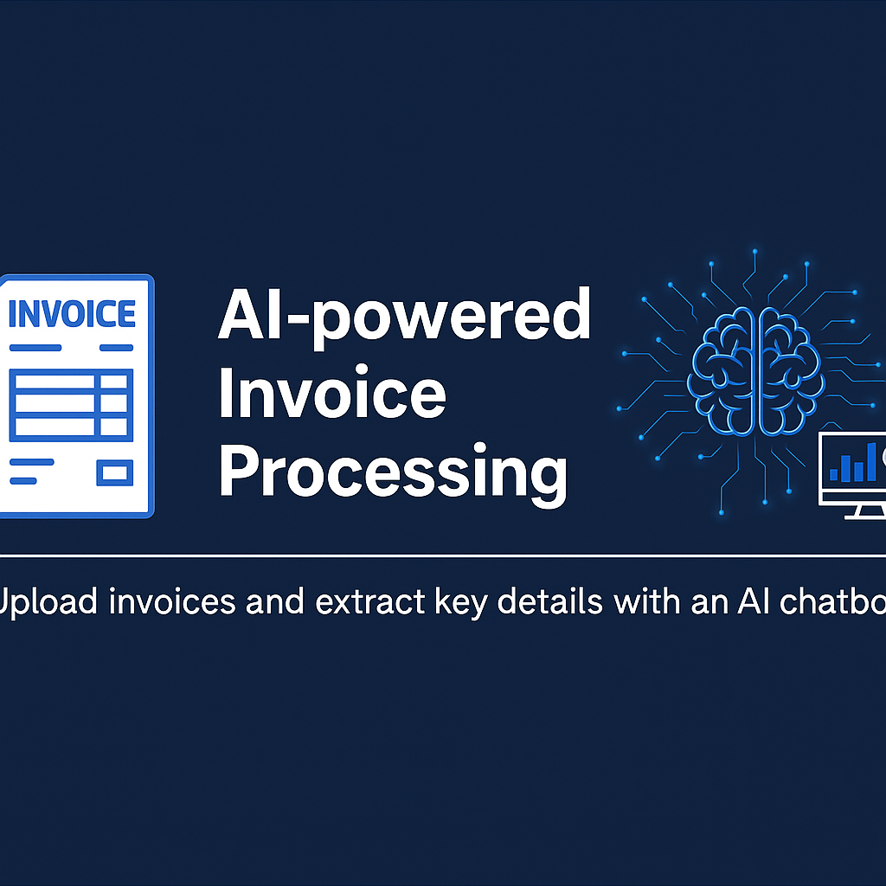

# SAIL-PROJECT-FINAL
This is a full-stack Vendor Invoice Management System built as part of my internship at Steel Authority of India Limited (SAIL). It helps streamline invoice uploads, approvals, and sales predictions using OCR and AI.

Login/register→ Upload Invoice →  Extract Text (OCR) → Store in MySQL →  Use in Chatbot or Dashboard
SAIL-PROJECT/

Tech Stack
Frontend	Backend	AI & OCR	Database
HTML, CSS, JS	PHP (Replit)	Tesseract OCR	MySQL (FreeSQL)
Chart.js	Streamlit Chatbot	Google Colab + Prophet	

---
👉 IMPORTANT: This repo originally contained database credentials. They’ve now been removed for security.
📌 If you're forking this, please add your credentials to a separate config.php file and don’t commit it!

---

Feel free to explore or contribute!
